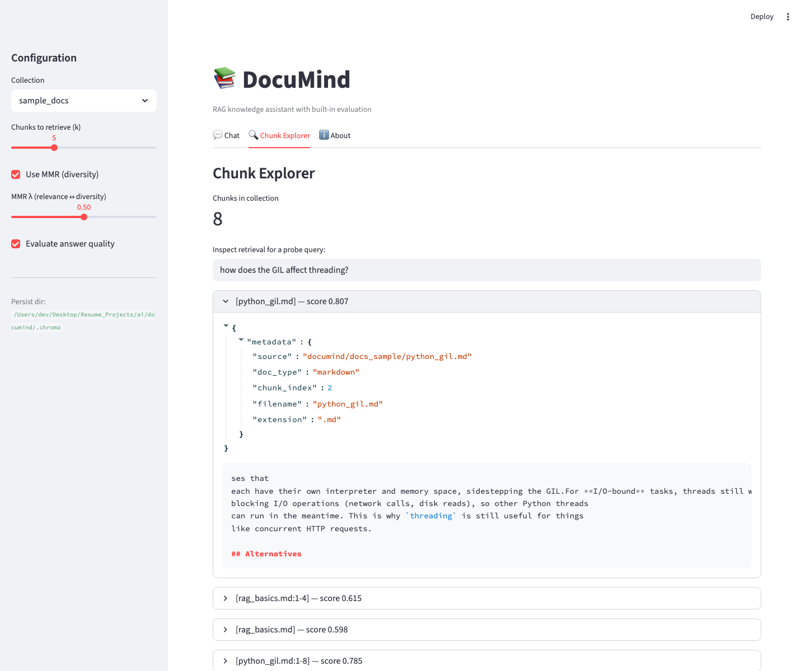
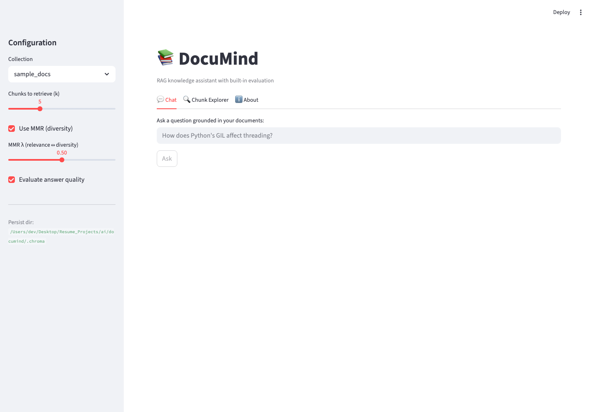
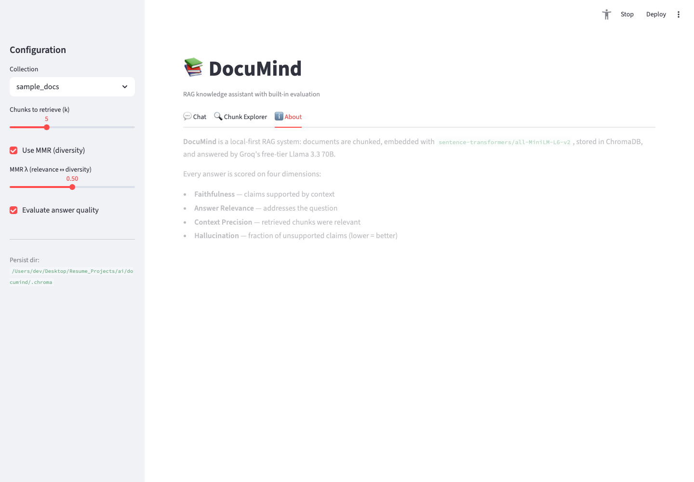

# DocuMind — RAG Knowledge Assistant with Evaluation Suite

A retrieval-augmented generation (RAG) system that ingests documents (PDFs, Markdown, code), chunks and embeds them locally, stores in a vector database, and answers questions grounded in your data — with a built-in evaluation framework measuring faithfulness, relevance, and hallucination rate.



## Screens

| | |
|---|---|
|  |  |
| **Chat** — ask a question; the answer is generated by Groq Llama 3.3 70B grounded in retrieved chunks, with eval scores rendered alongside | **About** — the four evaluation dimensions and the local-first architecture (sentence-transformers + ChromaDB + Groq) |

## Why This Project

- **RAG is top-3 most in-demand AI skill** — appears in 70%+ of AI engineer job postings (2026)
- Shows: embeddings, vector databases, chunking strategies, prompt engineering, evaluation
- Every company building AI products needs RAG — it's the bridge between generic LLMs and domain-specific intelligence
- Built-in evaluation suite shows you understand production AI quality, not just demos

## The Problem

LLMs hallucinate. Companies need AI that answers from their own data, not training data. RAG solves this, but most implementations are naive — bad chunking, no evaluation, no way to know if answers are actually grounded. DocuMind solves the full pipeline including quality measurement.

## What It Does

```
┌─────────────────────────────────────────────────────┐
│ DocuMind — Knowledge Assistant                       │
│                                                       │
│ 📁 Knowledge Base: 3 collections loaded              │
│    Python Docs (847 chunks) | RFC Specs (234 chunks) │
│    Internal Wiki (1,203 chunks)                       │
│                                                       │
│ 💬 Ask: "How does Python's GIL affect threading?"    │
│                                                       │
│ Answer: Python's GIL (Global Interpreter Lock)       │
│ prevents multiple threads from executing Python       │
│ bytecode simultaneously. For CPU-bound tasks, use    │
│ multiprocessing instead. For I/O-bound tasks,        │
│ threading still helps because the GIL is released    │
│ during I/O operations.                                │
│                                                       │
│ Sources: [python-docs/threading.md:42-68]            │
│          [python-docs/multiprocessing.md:15-30]      │
│                                                       │
│ ┌─────────────────────────────────────────┐          │
│ │ Evaluation Scores                       │          │
│ │ Faithfulness:      0.94 ████████████░   │          │
│ │ Answer Relevance:  0.91 ███████████░░   │          │
│ │ Context Precision: 0.87 ██████████░░░   │          │
│ │ Hallucination:     0.06 █░░░░░░░░░░░░   │          │
│ └─────────────────────────────────────────┘          │
│                                                       │
│ Eval Dashboard    Chunk Explorer    Settings          │
└─────────────────────────────────────────────────────┘
```

### Features

**Built and shipping:**
- **Multi-format ingestion** — PDF, Markdown, plain text, plus 10 code extensions (`.py`, `.ts`, `.tsx`, `.js`, `.jsx`, `.go`, `.rs`, `.java`, `.c`, `.cpp`, `.h`)
- **Smart chunking** — recursive character splitting with overlap; code-aware separators for source files
- **Local embeddings** — HuggingFace `sentence-transformers/all-MiniLM-L6-v2` (no API calls during indexing or retrieval)
- **Vector search** — ChromaDB with cosine similarity and **Maximal Marginal Relevance (MMR)** diversity reranking
- **LLM generation** — Groq Llama 3.3 70B with explicit source-chunk citations on every answer
- **Evaluation suite** — faithfulness, answer relevance, context precision, hallucination rate (LLM-as-judge + embedding similarity)
- **Chunk explorer** — Streamlit tab showing which chunks were retrieved, their similarity scores, and source citations
- **GitHub Actions CI** — unit tests + an end-to-end ingest + retrieval smoke test on every push (Python 3.11 and 3.12)

**Planned (see Roadmap):**
- Side-by-side A/B comparison of chunking strategies and embedding models from the dashboard
- Cross-encoder reranker (scaffold exists in `retrieval/reranker.py`)

### Evaluation Metrics (What Sets This Apart)

Most RAG demos just retrieve and generate. DocuMind measures quality:

| Metric | What It Measures | How |
|---|---|---|
| **Faithfulness** | Is the answer supported by retrieved context? | LLM-as-judge compares answer claims to source chunks |
| **Answer Relevance** | Does the answer address the question? | Embedding similarity between question and answer |
| **Context Precision** | Are the retrieved chunks actually relevant? | LLM-as-judge scores each chunk's relevance |
| **Hallucination Rate** | Does the answer contain unsupported claims? | Cross-reference answer statements with sources |

## Architecture

```
┌──────────┐    ┌──────────────┐    ┌──────────────┐    ┌──────────┐
│ Documents│───▶│  Chunking    │───▶│  Embedding   │───▶│ ChromaDB │
│ (PDF,MD) │    │  Engine      │    │  (HuggingFace│    │ (Vector  │
│          │    │              │    │   local)     │    │  Store)  │
└──────────┘    └──────────────┘    └──────────────┘    └──────────┘
                                                              │
┌──────────┐    ┌──────────────┐    ┌──────────────┐          │
│ Streamlit│◀───│  Groq LLM    │◀───│  Retriever   │◀─────────┘
│ Dashboard│    │  (free)      │    │  (similarity  │
│          │    │              │    │   + MMR)      │
└──────────┘    └──────────────┘    └──────────────┘
      │
      ▼
┌──────────────┐
│  Evaluation  │
│  Suite       │
│  (RAGAS-style│
│   metrics)   │
└──────────────┘
```

## Tech Stack (All Free)

| Component | Tool | Cost |
|---|---|---|
| Embeddings | `sentence-transformers/all-MiniLM-L6-v2` (local, 80MB) | $0 |
| Vector DB | ChromaDB (local, open source) | $0 |
| LLM | Groq (Llama 3.3 70B, free tier: 6K tokens/min) | $0 |
| Chunking | LangChain text splitters (open source) | $0 |
| PDF Parsing | PyMuPDF / pdfplumber (open source) | $0 |
| Evaluation | Custom RAGAS-inspired metrics (no API needed for embedding-based) | $0 |
| Dashboard | Streamlit on Streamlit Community Cloud | $0 |
| CI/CD | GitHub Actions | $0 |

## Project Structure

```
documind/
├── ingestion/
│   ├── loader.py              # Multi-format document loader
│   ├── chunker.py             # Chunking strategies (recursive, code-aware)
│   └── embedder.py            # HuggingFace embedding wrapper
├── retrieval/
│   ├── vector_store.py        # ChromaDB interface
│   ├── retriever.py           # Similarity + MMR retrieval
│   └── reranker.py            # Cross-encoder reranking (optional)
├── generation/
│   ├── prompts.py             # Prompt templates with source citation
│   └── llm.py                 # Groq client wrapper
├── evaluation/
│   ├── faithfulness.py        # Answer grounded in context?
│   ├── relevance.py           # Answer addresses the question?
│   ├── precision.py           # Retrieved chunks relevant?
│   ├── hallucination.py       # Unsupported claims detection
│   └── benchmark.py           # Run eval suite on test questions
├── dashboard/
│   └── app.py                 # Streamlit chat + eval dashboard
├── tests/
│   ├── test_chunking.py
│   ├── test_retrieval.py
│   └── test_evaluation.py
└── README.md
```

## Run Locally

```bash
# 1. Clone and create a venv inside the repo
git clone https://github.com/DevNagi31/documind.git
cd documind
python -m venv .venv && source .venv/bin/activate
pip install -r requirements.txt

# 2. Set your Groq API key (free at https://console.groq.com)
cp .env.example .env  # then edit GROQ_API_KEY=...

# 3. Ingest the sample docs (or point --path at your own folder)
#    The `documind` package lives at the repo root, so run from the parent dir:
cd .. && python -m documind.ingest --path documind/docs_sample --collection demo

# 4. Launch the dashboard
streamlit run documind/dashboard/app.py
# → http://localhost:8501

# 5. (Optional) Run the eval suite on the 15 seed questions
python -m documind.evaluate --collection demo --test-set documind/eval_questions.json
```

### Useful scripts

```bash
pytest -q tests/           # 15 unit tests across chunking, retrieval/MMR, eval helpers
```

## Sample Evaluation Output

The seed test set (`eval_questions.json`) contains 15 questions across the two sample docs
(`docs_sample/python_gil.md`, `docs_sample/rag_basics.md`). A full eval run with `GROQ_API_KEY`
set against a freshly-ingested `demo` collection produces output of the form:

```
Evaluation Results (15 test questions)
──────────────────────────────────────
Faithfulness:       0.9X (±0.0X)
Answer Relevance:   0.8X (±0.0X)
Context Precision:  0.8X (±0.0X)
Hallucination Rate: 0.0X
```

Exact numbers depend on the model snapshot Groq is serving — re-run with your own key
to reproduce.

This is the project that shows you can build production-grade AI, not just call an API.
